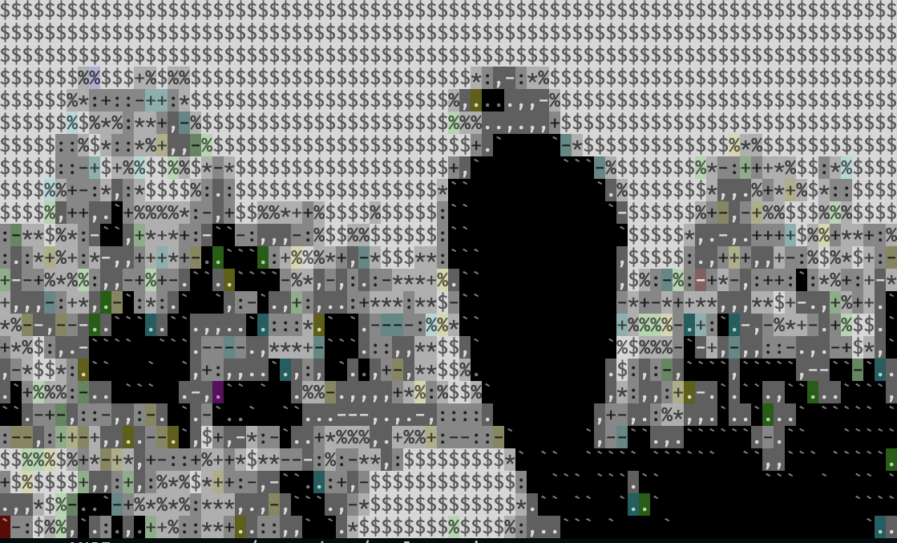

# image_or_video_to_ansi_frames

A standalone Rust CLI that converts an image into xterm-256 ANSI art — decode a JPEG, downsample it to a grid of terminal-sized character cells, quantize each cell's color into the 256-color palette, and emit real ANSI escape sequences. Written as a from-scratch Rust rewrite of [`stiv-jpeg`](https://github.com/wildbunny/tiv) (the suckless "tiv" terminal image viewer).

## Example

| Before (source image) | After (rendered ANSI output) |
| :---: | :---: |
|  |  |

The right image is a real screenshot of this tool's `--create-html-output` file, rendered with the same CSS the philosophy-notes site uses to display its ANSI art in a browser. Viewed directly in a terminal, `test_data/output.ansi` renders with real ANSI escape codes and looks even sharper.

## Usage

```sh
cargo run -- \
  --image-or-video-file ./test_data/test.jpeg \
  --output-file-name ./test_data/output.ansi \
  --create-html-output \
  --html-output-file ./test_data/output.html


# or 

cargo run -- \
  --image-or-video-file ./test_data/eagle.jpeg \
  --output-file-name ./test_data/eagle.ansi 
```

- `--image-or-video-file` — path to the source JPEG (defaults to `./test_data/test.jpeg`)
- `--output-file-name` — where the raw ANSI-escaped `.ansi` text gets written (defaults to `./test_data/output.ansi`)
- `--create-html-output` — also emit a self-contained HTML file that renders the same grid in a browser, styled like the philosophy-notes site
- `--html-output-file` — where that HTML file gets written (defaults to `./test_data/output.html`)

## How it works

1. Decode the JPEG with `zune-jpeg` into a flat `Vec<u8>` of raw RGB bytes.
2. Group the pixels into `(r, g, b)` triplets and bucket them into a `cols x rows` grid of character cells — `rows` is derived from the source image's aspect ratio, corrected for the fact that a monospace character cell is narrower than it is tall.
3. Average each cell's pixels down to one color, then quantize that color into the xterm-256 palette (the 6x6x6 color cube, indices 16-231).
4. Pick an ASCII glyph per cell from an 11-character brightness ramp (`` `.,-:+*%$#``), so cells carry both color and a bit of density texture.
5. Print the grid as real ANSI escape sequences (`\x1b[38;5;<n>m`/`\x1b[48;5;<n>m` per cell, `\x1b[0m` + newline per row) to the terminal and to a `.ansi` file, and optionally render the same grid to a standalone HTML file.


## TODOs:
- Fix HTML output.


## Goals
- Mimic `stiv-jpeg`'s "half-block" trick — two different colors per character cell (foreground from the top half of a cell's source pixels, background from the bottom half), instead of one flat averaged color per cell
- Extend to video/GIF input, converting frame-by-frame and in parallel with `rayon`

## Stretch Goals

- WASM build that overwrites an image one (or several) pixels at a time, parallelized, for a cool live-conversion effect in the browser
- Parallelized frame-by-frame video conversion, with a wall-clock comparison against a sequential baseline
